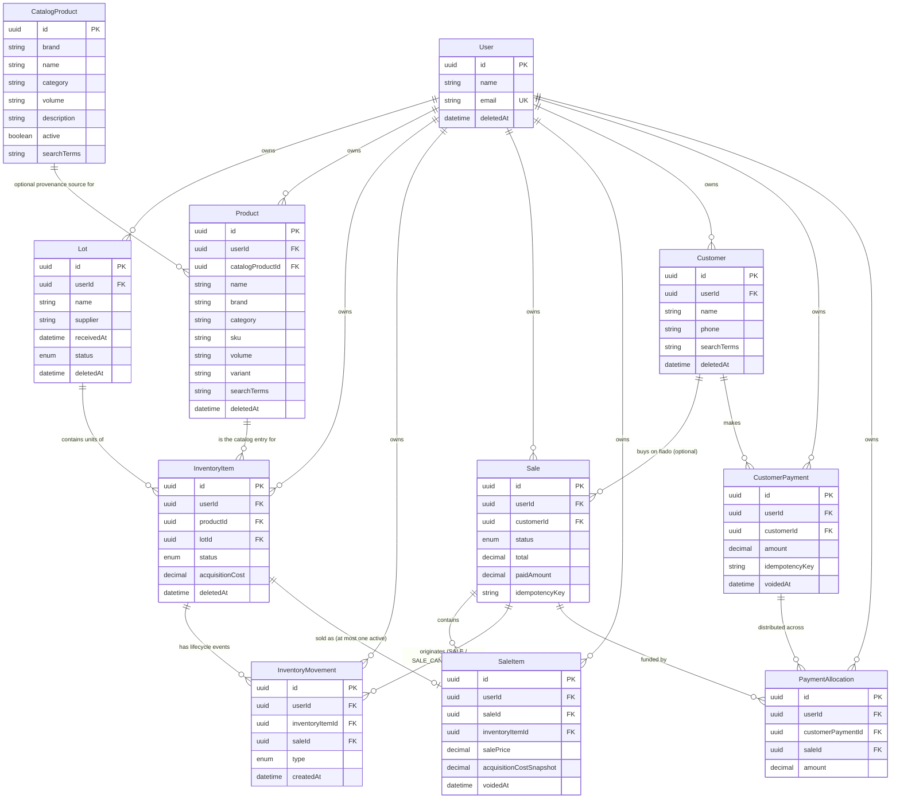

# Database

The Lotea MVP data model: what each of the 12 models represents, how they relate, and the invariants the schema and service layer together enforce. Read this alongside [ARCHITECTURE.md](ARCHITECTURE.md) §6 (which states the conventions every model follows) and `apps/api/prisma/schema.prisma` (the source of truth for exact types/constraints).

## Overview

Lotea tracks resale inventory unit-by-unit. A **Lot** is a purchase batch; a **Product** is reusable catalog identity (what something *is*); an **InventoryItem** is one physical unit bought in a lot, at that lot's cost; a **Sale** groups the **SaleItems** sold in one transaction; and an **InventoryMovement** is an immutable log entry for every state change an InventoryItem goes through. Every one of these belongs to a **User** — the tenant boundary.

The recurring design idea, carried over from [ARCHITECTURE.md](ARCHITECTURE.md) §6.6: **nothing that can be derived is stored.** Stock counts, lot cost, lot revenue, and lot profit are never columns — they're always computed from the rows that actually make them up, so they can never drift out of sync with reality.

## Entity-relationship diagram



## Models

### User

The tenant boundary. Every other model belongs to exactly one User via `userId`, and every repository query is scoped by it (§ Multi-tenant isolation, below). `passwordHash` is bcrypt output (never a plain password, never logged — see Authentication, below); `email` is globally unique (it's a login, not a per-tenant value).

### RefreshToken

One row per issued refresh token: `tokenHash` (a SHA-256 hash of the token — the raw token is never stored, so a leaked row can't be replayed), `expiresAt`, `revokedAt` (nullable). Deliberately minimal compared to the audit tiers below: no `updatedAt`/`createdBy`/`updatedBy` — a refresh token has exactly one actor (its own owner, at login) and exactly one state change in its life (revocation), so `revokedAt` alone is a sufficient "was this modified" signal. See Authentication, below.

### Lot

A purchase batch: `name`, `supplier`, `receivedAt`, `notes`, `status` (the shared `LotStatus` enum: `ACTIVE` / `FINISHED` / `ARCHIVED`). A lot has no stored total cost — see Financial invariants.

### Product

The **canonical catalog entry** — reusable identity only: `name`, `brand`, `category`, `sku`, `volume` (e.g. "100ml"), `variant` (e.g. "Masculino"/"Feminino"/"Infantil" — a product line variant, distinct from `category`). It never carries a cost or price: the same catalog product can be bought at different acquisition costs across different lots (see requirement 3 / `InventoryItem` below), and a product bought in one lot can be sold at different prices later — none of that lives here.

`searchTerms` is a normalized, lowercase, accent-stripped blob of every searchable field, maintained by the service layer — see Product catalog search, below.

`catalogProductId` (nullable) is a **provenance-only** pointer to the `CatalogProduct` this Product was created from, when it was created that way (null for manually-registered products). It is set once, at creation, and never read again to derive this Product's own fields — see CatalogProduct, below, and Global product catalog.

### CatalogProduct

A **global, shared reference catalog entry** (e.g. "Natura Kaiak Clássico") — not tenant-scoped: it has no `userId`, and every authenticated user searches the same rows. Fields: `brand` (required), `name`, `category`, `volume` (defaults to `""`, never `null` — see below), `description` (a short, presentational blurb, never searched), and `active` (the hide/show flag for this table). Selecting a `CatalogProduct` when creating a `Product` copies `name`/`brand`/`category`/`volume` onto the new `Product` once; the `Product` never depends on this entry again afterward, even if it's later edited or deactivated. Full rationale, the search strategy, and the reuse of `POST /products`: see Global product catalog, below.

`brand` and `volume` are deliberately **not nullable** (`volume` defaults to `""` when not applicable) even though the equivalent fields are nullable on `Product` — this keeps the natural key `@@unique([brand, name, volume])` reliable for idempotent seed upserts, since Postgres treats every `NULL` as distinct in a unique index and would otherwise let duplicate rows slip through silently.

### InventoryItem

**One row per physical unit.** This is the core modeling decision in the whole schema: stock is never a `quantity` integer on `Product` or `Lot` — that would collapse ten individually-sellable units into one number, losing which unit came from which lot, at what cost, and whether it's still in stock. Instead:

```
Lot  ──contains──▶  InventoryItem (one row per unit)  ──belongs to──▶  Product (catalog identity)
```

Each `InventoryItem` belongs to exactly one `Product` (what it is) and exactly one `Lot` (which batch it came from, and therefore its cost basis). `acquisitionCost` is frozen at creation time from that lot's purchase — never recalculated retroactively, even if the lot's records are corrected later. `status` is the shared `InventoryItemStatus` enum: `IN_STOCK`, `RESERVED`, `SOLD`, `WRITTEN_OFF`. See Inventory lifecycle, below, for how and when it changes. `expiresAt` (nullable) is an optional expiration date set at purchase-entry time, for perishable goods.

### InventoryMovement

**One immutable row per InventoryItem state change** — never updated, never deleted (see Audit field policy). This is the audit trail that makes "each unit individually traceable throughout its lifecycle" (requirement 4) a real, queryable fact rather than an aspiration: querying `InventoryMovement` by `inventoryItemId` ordered by `createdAt` reconstructs exactly what happened to that one unit, in order.

`type` is the shared `InventoryMovementType` enum, covering every state change requirement 5 asked for:

| Type | When it's recorded |
|---|---|
| `PURCHASE_ENTRY` | A unit is created via "Entrada" (registering a lot purchase) |
| `SALE` | A unit is sold |
| `RESERVATION` | A unit is held for a customer, not yet sold |
| `RESERVATION_RELEASE` | A hold is released without a sale |
| `RETURN` | A customer returns a sold unit |
| `MANUAL_ADJUSTMENT` | A correction outside the normal flow (e.g. a count discrepancy) |
| `SALE_CANCELLATION` | A sale is cancelled, reversing the unit back to `IN_STOCK` |
| `WRITE_OFF` | A unit is removed from stock (damaged, lost) |

Only `PURCHASE_ENTRY`, `SALE`, and `SALE_CANCELLATION` are wired to service-layer code today (`inventory.service.ts`, `sales.service.ts`); the rest are modeled in the enum and schema so the next feature that needs them doesn't require a migration.

`saleId` (nullable) links a movement back to the `Sale` that caused it, when relevant (`SALE`, `SALE_CANCELLATION`).

### Sale

A transaction: `status` (the shared `SaleStatus` enum — `PENDING`, `PARTIALLY_PAID`, `PAID`, `CANCELLED`, `REFUNDED`), `total` (an immutable snapshot, see Financial invariants), `paidAmount` (how much has actually been received toward `total`), `customerId` (nullable — required whenever `paidAmount < total`), and `idempotencyKey` (see Offline idempotency). **A Sale is never deleted.** Cancellation is a status transition, reversed through compensating `InventoryMovement` rows (see Sale cancellation, below) — never a row deletion, which is why `Sale` has no `deletedAt` (see Audit field policy).

`paidAmount` and `status` are stored, service-maintained values, not freely settable columns — see Accounts receivable, below, for the full reconciliation invariant (`paidAmount` always equals the live sum of this sale's active `PaymentAllocation` rows), how `status` is computed, and the one documented exception (historical, pre-migration sales).

### SaleItem

An immutable snapshot of one sold `InventoryItem`: `salePrice` (what it actually sold for) and `acquisitionCostSnapshot` (a *copy* of the InventoryItem's acquisition cost at the moment of sale — see Financial invariants for why this is a deliberate duplication, not redundancy). `voidedAt` is set when the parent Sale is cancelled; it's what excludes the item from revenue/profit queries and what frees the InventoryItem to be resold (see Preventing double-selling a unit).

### Customer

A seller's own customer, for tracking "fiado" (buy-now-pay-later) sales: `name`, `phone` (nullable), `notes` (nullable), `searchTerms` (normalized `name` — the only searchable field). Duplicate names are expected and allowed — there is no natural-key uniqueness on `name` at all; the duplicate-check at creation is a pure UX nudge (mirrors `Product`'s own), never a DB constraint. Full audit tier — a real, soft-deletable tenant record, not reference data. See Accounts receivable, below.

### CustomerPayment

One row per money-received event — customer optional. `customerId` is nullable: a fully-paid sale with **no** customer still creates one of these, which is what makes "total received" reporting correct for walk-in (à-vista) sales, not just accounts-receivable customers. `amount`, `notes` (nullable), `idempotencyKey` (mirrors `Sale.idempotencyKey` exactly), and `voidedAt` (nullable — reversal marker, mirrors `SaleItem.voidedAt`: the row is never deleted, a later estorno just sets this timestamp). See Accounts receivable, below.

### PaymentAllocation

The many-to-many join between `CustomerPayment` and `Sale`: one payment can fund multiple sales (FIFO distribution) and one sale can be funded by multiple payments over time. `amount` is how much of the payment went to that specific sale. Immutable, append-only — never updated or deleted, even when the parent `CustomerPayment` is later voided; the reversal is represented entirely by `CustomerPayment.voidedAt`, and allocations stay as permanent historical proof of what happened. See Accounts receivable, below.

## Multi-tenant isolation

Every business model — `Lot`, `Product`, `InventoryItem`, `InventoryMovement`, `Sale`, `SaleItem`, `Customer`, `CustomerPayment`, `PaymentAllocation` — carries `userId` **directly as its own column**, not only reachable by joining through a parent. This is deliberate denormalization: it means every repository query scopes by `WHERE userId = ?` directly, with no join required, on every single table, and every table has an index that leads with `userId` to support it. `packages/shared`'s `id.ts`/schemas don't enforce this — it's a repository-layer discipline: **every** `findFirst`/`findMany`/`update` in `apps/api/src/features/**/*.repository.ts` includes `userId` in its `where` clause. The tenant-isolation tests (`src/test/tenant-isolation.test.ts` and the cross-tenant checks in each feature's own test file) assert this holds even when two tenants have identical-looking data (same product names, same lot names) — isolation must never depend on data happening to look different.

## Authentication

`User.passwordHash` and `RefreshToken` are the only two auth-related tables — there's no separate `Session` model. The flow:

- **Register/login**: passwords are hashed with `bcryptjs` (12 salt rounds) via `shared/lib/password.ts`; the hash is the only thing ever persisted or logged. Login compares against a dummy bcrypt hash when the email isn't found at all, so a mismatched email and a mismatched password take the same amount of time — timing alone can't be used to enumerate registered emails.
- **Tokens**: login/register/refresh issue a short-lived JWT access token (`JWT_ACCESS_TTL_SECONDS`, default 15 min, signed with `JWT_ACCESS_SECRET`) plus a long-lived opaque refresh token (`JWT_REFRESH_TTL_SECONDS`, default 30 days). The access token is a signed JWT and is never persisted server-side — it's stateless, verified on each request by `plugins/authenticate.ts`. The refresh token is the opposite: a random 32-byte value returned to the client once, with only its SHA-256 hash (`RefreshToken.tokenHash`) stored — the raw value can't be recovered from the database, so a leaked database dump alone can't be replayed as a session.
- **Refresh rotation**: each call to `/auth/refresh` looks up the presented token by its hash, checks it's neither expired nor already `revokedAt`, then — inside one transaction — marks it revoked and issues a brand-new refresh token row. A stolen-and-reused old token becomes a detectable signal (its `revokedAt` is already set) rather than a silently-still-valid credential.
- **Logout** sets `revokedAt` on the presented refresh token; it does not (and cannot) invalidate an already-issued access token before its natural expiry — this is the standard short-access/long-refresh tradeoff, and why the access TTL is kept short.

## Audit field policy

Every model needs `createdAt`/`updatedAt`/`deletedAt`/`createdBy`/`updatedBy` in principle (ARCHITECTURE.md §6.3), but not every model can legitimately be updated or deleted — stamping all five fields everywhere regardless would misrepresent models that are actually append-only. The schema uses three graduated tiers instead:

| Tier | Fields | Models | Why |
|---|---|---|---|
| Full | `createdAt`, `updatedAt`, `deletedAt`, `createdBy`, `updatedBy` | `User`, `Lot`, `Product`, `InventoryItem`, `Customer` | Soft-delete is a real lifecycle operation (a seller stops stocking a product, deactivates their account, removes a customer with no open balance) |
| Mutable, never deleted | `createdAt`, `updatedAt`, `createdBy`, `updatedBy` | `Sale` | Status transitions (`PENDING` → `PAID` → `CANCELLED`/`REFUNDED`) are legitimate updates, but a Sale is never deleted — no `deletedAt` column at all, so deleting one isn't even structurally possible without a schema change |
| Immutable, append-only | `createdAt`, `createdBy` | `InventoryMovement`, `SaleItem`, `PaymentAllocation` | Created once, never updated or deleted — no `updatedAt`/`deletedAt`/`updatedBy` at all |
| Immutable, append-only + `voidedAt` | `createdAt`, `createdBy`, `voidedAt` | `CustomerPayment` | Same tier as above, plus a nullable reversal marker — mirrors `SaleItem.voidedAt` exactly: the row is never deleted, a later estorno just sets this timestamp |
| Minimal (not a business record) | `createdAt`, `revokedAt` | `RefreshToken` | A security artifact, not a tenant business record — no `userId`-style actor trail beyond the `userId` it belongs to; see Authentication |
| System-maintained reference data | `createdAt`, `updatedAt`, `createdBy`?, `updatedBy`? | `CatalogProduct` | Global, not owned by any tenant — `active` substitutes for `deletedAt` as the hide/show mechanism (see CatalogProduct, above). `createdBy`/`updatedBy` are nullable: no admin-actor model exists yet (a future admin panel, not built now), but the columns are already there — cheap to add now, expensive to backfill later |

**`createdBy`/`updatedBy` are plain UUID columns, deliberately *not* enforced Prisma relations to `User`.** Making them real relations would require a named self-relation (`@relation("XCreatedBy")`/`@relation("XUpdatedBy")`) *and* a corresponding inverse array field on `User` for every single model in this schema — a lot of ceremony for a field that, in this single-user-per-tenant MVP (per PRODUCT.md, there's no team/multi-staff-per-account feature), is almost always equal to the record's own `userId` anyway. The column still holds a real user id (there's no FK enforcing it points to an *existing* user, but application code always sets it from the authenticated actor) — this trades a small amount of DB-level enforcement for a much smaller, more legible schema. Revisit if/when a multi-staff-per-account feature needs to know *which staff member* touched a record, distinctly from who owns it.

## Inventory lifecycle

```
                 registerPurchaseEntry()                    createSale()
                          │                                      │
                          ▼                                      ▼
   ┌──────────┐    ┌────────────┐   RESERVATION    ┌──────────┐   SALE   ┌──────┐
   │ (none)   │───▶│  IN_STOCK  │◀─────────────────│ RESERVED │─────────▶│ SOLD │
   └──────────┘    └────────────┘  RESERVATION_     └──────────┘          └──┬───┘
                         ▲              RELEASE                              │
                         │                                                   │
                         └───────────────── SALE_CANCELLATION ───────────────┘
```

- **`registerPurchaseEntry`** (`inventory.service.ts`) is how units enter the system: given a quantity, it creates that many individual `InventoryItem` rows (never a stored quantity — see ARCHITECTURE.md §6.6) plus one `PURCHASE_ENTRY` movement each, all starting `IN_STOCK`.
- **`createSale`** (`sales.service.ts`) requires every referenced item to be `IN_STOCK`; it flips each to `SOLD`, snapshots its cost onto a new `SaleItem`, and records a `SALE` movement.
- **`cancelSale`** reverses this: every active `SaleItem` on the sale is voided (`voidedAt` set), its `InventoryItem` flips back to `IN_STOCK`, and a `SALE_CANCELLATION` movement is recorded — see Sale cancellation, below.
- **Reservation** (`RESERVED`) exists in the schema and enum today; only the `Entrada`/`Sale`/`Cancel` flows have service functions so far (see the InventoryMovement table above).

## Product catalog search

Requirement: as the user types a product name while adding it to a lot, show matching suggestions — ignoring capitalization and accents, tolerating typos and partial terms, searching across name/brand/category/sku/volume/variant — and, before creating a new catalog product, surface similar existing ones so spelling variations don't fragment the catalog into duplicates.

**No paid APIs or external services** — this runs entirely on Postgres's `pg_trgm` extension, a free, standard contrib module available on every mainstream managed Postgres (Neon, Railway, Supabase, RDS, etc.), enabled in the `add_product_catalog_search` migration.

**Normalization** (`packages/shared/src/lib/search.ts`, `normalizeSearchText`): lowercases, strips accents (Unicode NFD decomposition + stripping the combining-diacritics block), and collapses whitespace. The same function normalizes both what gets stored and what the user typed, so they compare on equal footing.

**Storage**: `Product.searchTerms` is a single normalized blob — `buildProductSearchTerms` concatenates `name`, `brand`, `category`, `sku`, `volume`, `variant` (never `notes` — not a searchable field per the requirement) and normalizes the result. It is maintained by `products.service.ts`'s `createProduct` on every write; it is **never** user-facing and **never** replaces the original `name` used for display.

**Query** (`products.repository.ts`'s `searchBySearchTerms`): combines two pg_trgm mechanisms, both accelerated by the same `Product_searchTerms_trgm_idx` GIN index (`gin_trgm_ops` supports both):

- **`word_similarity(query, searchTerms) > 0.4`** — tolerates typos. Plain `similarity()` was tried first and rejected: `searchTerms` concatenates *every* field into one blob, so a short single-word query (or a misspelling of one) scores low against the whole blob under plain similarity, even when it's a near-exact match for one word within it. `word_similarity` instead scores the query against its best-matching substring of the blob, which is what "tolerate typos in one word of a multi-word catalog entry" actually requires. (Covered by `products.service.test.ts` — "kaiac" successfully matches "Kaiak".)
- **`searchTerms ILIKE '%query%'`** — a substring fallback for very short partial terms that even word-similarity might under-rank.

Results are ordered by `word_similarity` descending. The whole thing is one function, `searchProducts`, used for two different moments in the same UX: as-you-type autocomplete, and the "check for duplicates before creating a new product" flow — the caller decides which moment it's in, the search itself doesn't need to know.

**Duplicate prevention**: `createProduct` never blocks on similar existing products — Lotea can't know whether a similar-sounding product is genuinely a duplicate or a legitimately new item (e.g. two different volumes of the same fragrance). The prevention is a UX flow, not a DB constraint: call `searchProducts` with the proposed name before calling `createProduct`; if a strong match comes back, present it as "usar produto existente" alongside a "Cadastrar novo produto" option (per the requirement's exact wording) rather than silently creating a near-duplicate catalog entry.

**Catalog scope and future evolution**: this section describes `Product.searchTerms` — the **per-tenant** search over what each seller has already registered. See "Global product catalog", immediately below, for the separate, shared catalog this complements.

## Global product catalog

Requirement: thousands of resellers sell the exact same handful of well-known products (Natura Kaiak, Boticário Malbec, Avon Far Away, and so on) — nobody should have to type one in from scratch. A seller searches a **global, shared** catalog (`CatalogProduct` — see Models, above) first; picking a result creates her own `Product` with its fields copied in. If nothing matches, the existing manual "cadastrar produto" flow (previous section) is unchanged.

**Same search machinery, a different table.** `catalog.repository.ts`'s `searchCatalogProducts` mirrors `products.repository.ts`'s `searchBySearchTerms` exactly — the same `word_similarity(...) > 0.4 OR ILIKE` combination, ordered by `word_similarity` descending, accelerated by its own GIN trigram index (`CatalogProduct_searchTerms_trgm_idx`) — with one difference: **no `userId` filter at all**, since every authenticated user searches the same global rows. `buildCatalogProductSearchTerms` (packages/shared) concatenates `name`/`brand`/`category`/`volume` only (no `sku`/`variant` — `CatalogProduct` doesn't have those; no `description`, which is presentational, not searchable — matching `Product.notes` being excluded from its own `searchTerms`).

**Two separate endpoints, not one merged search.** `GET /products/search` (tenant-scoped, a seller's own registered products) and `GET /catalog/search` (global) stay independent — the mobile client composes the two result sets (e.g. catalog suggestions above, "seus produtos" below) rather than the server merging two very differently-scoped queries into one ambiguous response. This also keeps tenant isolation trivially correct: a personalized product named similarly to a real catalog entry (e.g. "Kaiak Especial Promoção") can never appear in `/catalog/search` at all (it's a different table), and — unchanged from before — never leaks into another tenant's `/products/search` either.

**Reusing `POST /products`, not a new endpoint.** Creating a Product from the catalog is the same route as manual creation, extended additively: the request body may carry a `catalogProductId` instead of a manual `name`. When present, `products.service.ts`'s `createProductWithDuplicateCheck` resolves `name`/`brand`/`category`/`volume` from the `CatalogProduct` (via `catalogService.getActiveCatalogProduct` — the same cross-feature service-to-service read pattern `inventory.service.ts` uses for `productsService`), then runs through the *same, unmodified* duplicate-check → create path used by manual creation. Sending `catalogProductId` together with a manual `brand`/`category`/`volume` is rejected (400) rather than silently merged or dropped — those fields come from the catalog when a `catalogProductId` is given. `sku`/`variant`/`notes` remain valid either way, since `CatalogProduct` doesn't have those fields.

**"Never depends on the catalog again" is an invariant, not just a default.** Once created, a Product's own `name`/`brand`/`category`/`volume` are the source of truth — editing or deactivating the source `CatalogProduct` later never changes any Product already created from it. `catalogProductId` exists purely as a provenance pointer (see Models, above); nothing in the codebase ever joins through it to re-derive a Product's display fields.

**Seed strategy**: a static, hand-curated array (`apps/api/prisma/catalog-seed-data.ts` — real, well-known brand/product names, no external APIs, scraping, AI, or barcodes), upserted by `apps/api/prisma/lib/upsert-catalog-products.ts` on the `(brand, name, volume)` natural key. This is genuinely idempotent (safe to re-run anytime, including in production, unlike the destructive tenant-fixture `seed.ts`) — editing an entry and re-running updates it in place instead of duplicating it. Run standalone via `npm run db:seed:catalog`, or automatically as part of `npm run db:seed` for local dev.

**Not built now, by design**: no create/update/delete HTTP routes exist for `CatalogProduct` — a future admin panel adds them to `catalog.repository.ts`/`catalog.service.ts` without any schema change. `createdBy`/`updatedBy` are already present (nullable) on `CatalogProduct` for exactly that day, even though nothing populates them yet (see Audit field policy).

## Financial invariants

- **Decimal everywhere, never Float.** Every monetary column (`InventoryItem.acquisitionCost`, `Sale.total`, `Sale.paidAmount`, `SaleItem.salePrice`, `SaleItem.acquisitionCostSnapshot`, `CustomerPayment.amount`, `PaymentAllocation.amount`) is `Decimal(10, 2)`. Verified directly by `inventory.service.test.ts`'s "never loses cents to floating-point drift" test: ten sales of a 0.10-cost, 0.20-price item sum to exactly 1.00/2.00/1.00, not the 0.1+0.2-style drift native floats would introduce. No division is performed anywhere in the FIFO payment-distribution math (only `min()` and subtraction), so there's no rounding-mode decision to make there either.
- **Profit per sale item** is `SaleItem.salePrice − SaleItem.acquisitionCostSnapshot` — always derived, computed wherever it's needed (never a stored `profit` column, so it can never disagree with its own two inputs).
- **Lot revenue/cost/profit are never stored.** `Lot` has no `totalCost` column. `inventory.service.ts`'s `getLotFinancials` computes, on every read: `totalCost = SUM(InventoryItem.acquisitionCost)` for the lot, `revenue = SUM(SaleItem.salePrice)` and `realizedCostOfGoodsSold = SUM(SaleItem.acquisitionCostSnapshot)` across the lot's *active* sale items (`voidedAt IS NULL` — see below), and `realizedProfit = revenue − realizedCostOfGoodsSold`. A lot "hasn't recovered its investment" simply when `revenue < totalCost`.
- **`voidedAt IS NULL` is what makes cancellation invisible to revenue/profit.** A cancelled sale's items are excluded from every aggregate above by that one filter — there's no separate "is this sale cancelled" join required in the hot financial-read path.
- **Two exceptions are allowed to be stored, both immutable snapshots with a documented reason:**
  - `Sale.total` — the sum of its items' `salePrice` at creation time. A Sale's items never change after creation (only its `status` does), so this can never drift; storing it avoids re-aggregating on every read of a sale.
  - `SaleItem.acquisitionCostSnapshot` — a deliberate *copy* of `InventoryItem.acquisitionCost` at the moment of sale. `InventoryItem.acquisitionCost` is already frozen at creation and normally never changes either, but snapshotting it *again* onto the SaleItem is defense-in-depth: if a data-entry correction to an `InventoryItem` ever happens, past sales' profit history stays exactly what it was when the sale actually occurred.

## Offline idempotency

Sales created from the mobile offline outbox carry a client-generated `idempotencyKey`; `Sale.idempotencyKey` is unique **per user** (`@@unique([userId, idempotencyKey])`, not globally) — two different tenants' client-generated keys can coincide without conflict, and there's no cross-tenant key registry to manage.

`sales.service.ts`'s `createSale` handles a retried/duplicated submission in two layers:

1. **Pre-check**: if `idempotencyKey` is provided, look up an existing Sale with the same `(userId, idempotencyKey)` first. If found, return it — no new sale is created.
2. **Race-safe fallback**: if two requests with the same key race past the pre-check simultaneously, `createSale` re-checks for an existing sale under that key **whenever anything fails**, not only on a Postgres unique-violation. This matters because the *first* symptom a losing request hits under READ COMMITTED isn't always the `Sale_userId_idempotencyKey_key` constraint — if the winning twin transaction fully commits (marking the InventoryItem `SOLD`) in the gap between this request's pre-check and its own `status === 'IN_STOCK'` check, the loser instead sees a perfectly ordinary "item already sold" and throws `InventoryItemUnavailableError`, with no unique-violation involved at all. Re-checking for the sale on *any* failure catches both paths: if the twin's sale exists, it's returned and the caller never sees an error; if no such sale exists, the failure was real and unrelated, and it's rethrown unchanged.

Covered by `sales.service.test.ts`'s "offline idempotency" suite, including a genuine concurrent-race test (`Promise.allSettled` on two simultaneous `createSale` calls with the same key) that asserts both resolve to the *same* sale id.

## Preventing double-selling a unit

Requirement 10: the same `InventoryItem` must never appear in more than one **active** `SaleItem`. Two layers enforce this:

1. **Application fast path**: `createSale` checks `InventoryItem.status === 'IN_STOCK'` before selling it, throwing `InventoryItemUnavailableError` immediately for the common case (someone already sold it).
2. **Database-authoritative guard**: a **partial unique index**, `SaleItem_active_inventoryItemId_key` — `UNIQUE (inventoryItemId) WHERE voidedAt IS NULL`. Even if two concurrent requests both race past the status check before either commits, only one `INSERT INTO "SaleItem"` with a matching `inventoryItemId` and `voidedAt IS NULL` can succeed; the second raises a unique-violation, which `createSale` catches and converts to the same `InventoryItemUnavailableError`. This is also *why* `voidedAt` exists on `SaleItem` at all, rather than relying only on the parent `Sale.status`: Postgres partial-index predicates can only reference the indexed table's own columns, not a joined parent, so "is this sale item currently active" has to be a column on `SaleItem` itself.

**Prisma's schema DSL cannot express a partial (filtered) index** — there's no `@@unique(..., where: ...)`. This index is hand-added as raw SQL in `apps/api/prisma/migrations/20260716021327_init_mvp_model/migration.sql`, appended after the auto-generated `CREATE TABLE`/`ALTER TABLE` statements. **This has a real consequence for future schema changes**: because `schema.prisma` has no representation of this index, a future `prisma migrate dev` run may propose a migration that *drops* it (Prisma's diffing engine only knows what's in the schema file, and sees an "extra" index in the real database that it didn't ask for). **Do not accept that diff.** If it ever appears, edit the generated migration to remove the `DROP INDEX` line before applying. The same caveat applies to the `pg_trgm` extension and every hand-added, schema.prisma-invisible object — **seven** in total as of `add_customers_and_receivables`:
- Three GIN trigram indexes: `Product_searchTerms_trgm_idx` (`add_product_catalog_search`), `CatalogProduct_searchTerms_trgm_idx` (`add_catalog_product`), `Customer_searchTerms_trgm_idx` (`add_customers_and_receivables`).
- Four CHECK constraints, all added in `add_customers_and_receivables`, none representable in `schema.prisma` at all (unlike indexes, Prisma's diff engine won't propose dropping these — but there's also no automatic `IF NOT EXISTS`, so each is wrapped in a `DO $$ ... EXCEPTION WHEN duplicate_object THEN NULL; END $$;` guard so a future migration can defensively re-assert one without erroring if it's already present): `Sale_customer_required_when_outstanding`, `Sale_paid_amount_bounds`, `CustomerPayment_amount_positive`, `PaymentAllocation_amount_positive`.

Every future migration must be checked for a stray `DROP INDEX`/`DROP CONSTRAINT` targeting any of the seven.

Covered by `sales.service.test.ts`'s "rejects double-selling even if the application-level status check is bypassed" test, which deliberately resets an already-sold item's status to `IN_STOCK` (simulating a race the application check would miss) and asserts the database constraint still catches it.

## Accounts receivable

Resellers routinely deliver products before collecting full payment ("fiado") — partial payment, payment weeks later, or a customer who still owes money from a previous sale. `Customer`/`CustomerPayment`/`PaymentAllocation` (see Models, above) plus `Sale.customerId`/`paidAmount`/`status` implement this.

**Every payment — the initial one at sale creation, or a later one — is a `CustomerPayment` + `PaymentAllocation`, customer or not.** A first draft only created these rows when a `customerId` was present, writing `paidAmount` directly for no-customer (walk-in, fully-paid) sales. That broke two things: "total received in period" (below) would silently exclude every walk-in sale, since it sums `CustomerPayment.amount`; and reconciling `paidAmount` to allocations only held for *some* sales. The fix — `CustomerPayment.customerId` is nullable — makes the rule unconditional: **`Sale.paidAmount` always equals `SUM(PaymentAllocation.amount) WHERE saleId = this AND customerPayment.voidedAt IS NULL`, for every sale**, tested after every mutation (creation, later payment, void).

**`Sale.status` is a pure function** of `(total, paidAmount, cancelled)`, computed by one function (`sales/sale-status.ts`'s `computeSaleStatus`) used everywhere it's written, never accepted as API input: `PENDING` (`paidAmount = 0`), `PARTIALLY_PAID` (`0 < paidAmount < total`), `PAID` (`paidAmount >= total`), `CANCELLED` (unchanged from before this feature). `REFUNDED` stays unused. Both `paidAmount` and `status` are stored (not recomputed on every read) for cheap list/indicator queries — safe not because of a bare caching convention, but because every code path that can change `paidAmount` (initial payment, FIFO registration, void) creates/removes the matching `PaymentAllocation` in the *same transaction*; nothing writes one without the other, except historical sales (below).

**Sale creation** (`POST /sales`, body includes `receivedAmount` and an optional `customerId`): if `receivedAmount < total` and no `customerId` is given, `CustomerRequiredError` fires before any write (app-level fast path); the `Sale_customer_required_when_outstanding` CHECK constraint is the DB-level backstop, not the primary guard — same two-layer philosophy as double-selling prevention. If `receivedAmount > 0`, a `CustomerPayment` + `PaymentAllocation` targeting only the new sale are created in the same transaction — this is a deliberately separate, simpler code path from payment registration's FIFO loop (below), which is what guarantees "recebido agora" never touches a customer's older debts.

**Payment registration** (`POST /customers/:id/payments`, body `{amount, notes?, idempotencyKey?}`) distributes automatically across a customer's oldest open sales first:
1. `SELECT ... FOR UPDATE` on the customer's `PENDING`/`PARTIALLY_PAID` sales, **`ORDER BY "createdAt" ASC, "id" ASC`** — never bare `createdAt` (can tie at millisecond resolution); the deterministic tie-break means concurrent registration/void transactions for the same customer always request locks in the same order and serialize instead of deadlocking. Prisma's query builder has no row-lock API, hence raw SQL (`customers.repository.ts`'s `lockOpenSalesForCustomer`).
2. The balance is summed **from the just-locked rows**, never from an earlier unlocked read — a concurrent request blocks on the lock until the first commits, then re-reads the *already-reduced* balance before deciding. `PaymentExceedsBalanceError` fires if `amount` exceeds it.
3. `amount` is walked across the locked sales oldest-first: `allocation = min(remaining, sale.total - sale.paidAmount)` per sale, until exhausted.
4. `Sale_paid_amount_bounds` (`paidAmount >= 0 AND paidAmount <= total`) is the authoritative DB backstop if a bug ever bypassed the lock. `registerPayment`/`voidPayment` are additionally wrapped in a small bounded retry on Prisma's `P2034` (serialization/deadlock) as defense-in-depth, though the lock ordering already prevents a true deadlock between two such transactions.

Reproduces the request's own worked example exactly: Sale A (balance 60) + Sale B (balance 50), payment 80 → A settles with 60, remaining 20 → B's new balance 30.

**Idempotency** mirrors `Sale.idempotencyKey` exactly: `CustomerPayment.idempotencyKey` is unique per `(userId, idempotencyKey)`; a retried request with the same key returns the original payment (with its allocations) instead of creating a second one. The client is responsible for a stable key per distinct user action, regenerated only for a genuinely new payment.

**Cancellation and an active payment can never coexist.** `cancelSale` gains one guard, checked right after the existing "already cancelled → no-op" check: if `paidAmount > 0` (partially *or* fully paid — the same rule either way), it throws `SaleHasActivePaymentsError` and does nothing else. Cancelling items/restoring stock while money stays marked as received would be inconsistent, with no refund/credit mechanism (banned — see below) to reconcile it. The only path forward is voiding every payment allocated to the sale first (bringing `paidAmount` back to `0`); a second cancel call then succeeds via the unchanged path. Voiding a payment reverses every sale it funded (never partially) — `PaymentAllocation` rows stay untouched as permanent history; the reversal is entirely `CustomerPayment.voidedAt`. Correcting a wrong amount is void-then-reregister — there is no edit endpoint for a payment's amount, matching `SaleItem`'s own immutability.

**No positive credit balance, ever.** Cancelling a partially- or fully-paid sale never refunds, reallocates the collected money to another sale, or converts it to credit — `PaymentAllocation.saleId` is `NOT NULL` (no schema slot for "currently unattached money"), and if the customer has no other open sale, reallocating would require inventing exactly the stored-credit concept the product explicitly bans. History stays fully visible either way (a cancelled sale and its payment allocations are never hidden).

**Historical (pre-migration) sales are a self-identifying exception, not a special case in code.** Every sale created before this feature shipped has `status = 'PAID'` but `paidAmount` that was never written (backfilled once, in the `add_customers_and_receivables` migration, via `UPDATE "Sale" SET "paidAmount" = "total" WHERE "status" = 'PAID'` — a plain correction, no invented `CustomerPayment`/`PaymentAllocation` history, no fabricated receipt dates). Since every *new* sale's `paidAmount > 0` always comes with a matching allocation, **`paidAmount > 0` with zero `PaymentAllocation` rows is an unambiguous signature of a pre-migration sale** — no marker column needed. Two consequences fall out of already-necessary logic, with no extra check: such a sale never appears in the FIFO queue (`status` stays `PAID`, invisible to the `PENDING`/`PARTIALLY_PAID` filter) and can never be cancelled (blocked by the same `paidAmount > 0` guard, with nothing to void). Accepted, documented limitation: "total received in period" queries will never count a pre-migration sale, for any date range including its own original date.

**Financial indicators** (`GET /customers/receivables-summary?from=&to=`) — four independent numbers, derived, never conflated:
- `totalOutstanding` — `SUM(total - paidAmount)` over every `PENDING`/`PARTIALLY_PAID` sale, all customers.
- `customersWithBalanceCount` — distinct customers with such a sale.
- `totalSoldInPeriod` — `SUM(Sale.total)` for every non-cancelled sale in range, customer or not (accrual — "faturamento").
- `totalReceivedInPeriod` — `SUM(CustomerPayment.amount)` (non-voided) in range, customer or not (cash).

A fully-paid no-customer sale counts fully in `totalSoldInPeriod` and `totalReceivedInPeriod`, nothing in `totalOutstanding`. A partially-paid sale counts by its **full** total in "sold," by **only what's been collected** in "received," and by the **remainder** in "outstanding" — three independent, correct projections of the same one sale, never the same rupee counted twice under one label.

**Multi-tenant isolation, applied to a mutual dependency.** `sales.service.ts` calls into `customersService` (to resolve a `customerId` and record the initial payment) — the sanctioned cross-feature service-to-service pattern. `customers.repository.ts`, in turn, reads and writes `Sale.paidAmount`/`status` directly for payment registration/void, even though `Sale` otherwise belongs to `sales` — a deliberate, narrow, documented exception: having `customers` call back into `salesService` for this would create the exact circular service dependency this codebase's convention avoids elsewhere (see `lots.service.ts` not importing `inventory.service.ts`). Since `sales.repository.ts` only ever writes these fields at *creation*, and `customers.repository.ts` only ever writes them *after* creation, the two never race on the same code path.

## Financial dashboard

One consolidated `GET /dashboard/financial?from=&to=&granularity=&rankingLimit=` endpoint — not "dezenas de endpoints" — returning, for the selected period: `totalSoldInPeriod`, `totalReceivedInPeriod`, `totalOutstanding` (current position, ignores the period), `customersWithBalanceCount`, `salesByStatus` (paid/partiallyPaid/pending/cancelled counts), `averageTicket` (non-cancelled sales only), a day/week/month `timeline` of sold+received, `topCustomersByBalance`, `topProducts`, `topBrands`, and `recentPayments`.

**`dashboard.service.ts` is a pure orchestrator — there is no `dashboard.repository.ts`.** ARCHITECTURE.md §6 states cross-feature reads go through the other features' *service* functions, never their repositories directly; every figure above is computed by the feature that already owns the underlying model, and the dashboard only calls those functions in parallel (`Promise.all`) and assembles the response:

| Figure | Lives in |
|---|---|
| `totalOutstanding`, `customersWithBalanceCount`, `totalSoldInPeriod`, `totalReceivedInPeriod` | `customers.getReceivablesSummary` (reused unchanged — see Accounts receivable, above) |
| `salesByStatus`, `averageTicket`, sold half of `timeline` | `sales.service.ts` |
| received half of `timeline`, `recentPayments` | `customers.service.ts` |
| `topCustomersByBalance` | `customers.listCustomers` (reused unchanged, `sort: 'balance', hasBalance: true`) |
| `topProducts`, `topBrands` | `products.service.ts` — output is product-centric, the same reasoning `inventory.service.ts` already uses for reading through `Sale`/`SaleItem` to compute lot financials |

**Date/timezone rules.** `from`/`to` are inclusive on both ends. Every new period-scoped query (everything except `getReceivablesSummary`, which keeps its own pre-existing `gte`/`lte` semantics) uses `createdAt >= from AND createdAt < toExclusive`, where `toExclusive` is computed once (`to` plus one day) in `dashboard.service.ts` and passed down — a single, consistent boundary convention, reconciled against `getReceivablesSummary`'s different-but-already-inclusive convention rather than silently disagreeing with it. All date arithmetic is UTC-only (`Date.UTC`/`setUTCDate`/`setUTCMonth` — never a local-time constructor; no date library exists in this repo). The sold/received timeline is bucketed by Postgres's own `date_trunc('day'|'week'|'month', ...)`; the JS cursor that zero-fills empty buckets is snapped to the exact same boundary (`'week'` truncates to Monday, ISO 8601) *before* looping, or the generated keys would silently never match the SQL-truncated ones and every bucket would look empty.

**Index**: `SaleItem` gained `@@index([userId, createdAt])` (added in `add_sale_item_created_at_index`, a normal Prisma-representable index — no hand-editing required) for the period-scoped `topProducts`/`topBrands` queries, which filter directly on `SaleItem.createdAt` rather than joining to `Sale` (cancelled-sale exclusion already comes for free from the existing `voidedAt IS NULL` filter).

## Lot composition: a derived view, not a new debt entity

A customer's debt stays **strictly singular** — the FIFO mechanism above is completely unchanged. "How much of Maria's balance comes from Lot 30 vs. Lot 32" is answered by a purely derived, read-only grouping of her currently-open (`PENDING`/`PARTIALLY_PAID`) sales by lot, computed fresh on every read — no new entity, no payment ever associated with a lot, no per-lot debt or credit concept.

**Why this needs an apportionment rule at all**: nothing constrains a Sale's items to one lot — a single checkout can include one unit from Lot 30 and another from Lot 32. Payment tracking (`PaymentAllocation`) is scoped to a whole `Sale`, never to a `SaleItem`, so "how much of this sale's outstanding balance belongs to which lot" isn't automatically well-defined for a multi-lot sale.

**The rule — proportional attribution by item value, exact to the cent.** Since `Sale.total` is guaranteed equal to `SUM(item.salePrice)`, each lot's exact share of a sale is `weight_lot / total` (`weight_lot` = that lot's items' `salePrice` summed within the sale). Applying that share to the sale's outstanding balance with plain rounding could leave the parts not summing back to the true total — instead, `apps/api/src/shared/lib/lot-apportionment.ts`'s `apportionAmountByWeight` uses the **largest-remainder method**: convert to integer cents, floor each lot's raw share, then hand out the few leftover cents one at a time to the lots whose share was rounded down the *most* (largest fractional remainder), tie-broken by larger weight, then by ascending key (a UUID — a total order) — fully deterministic, and the parts always sum to *exactly* the original amount. All in `Prisma.Decimal`, never floating point; a locally-cloned, higher-precision `Decimal` flavor (40 significant digits) guards the intermediate division against ever landing a cent short of an exact boundary. Only `outstanding` is ever apportioned — a lot's exact revenue needs no apportionment at all (an item unambiguously belongs to one lot), and "total recebido" for a lot is derived by exact subtraction (`revenue - outstanding`) rather than a second, independent apportionment that could disagree by a cent.

**Where it lives**: `inventory.service.ts`'s `getLotCustomerBalances` ("Clientes com saldo referente ao lote") — extends the *existing* `getLotFinancialAggregates`, which already joins `SaleItem`→`InventoryItem` by `lotId`. `getLotFinancials` gained `totalReceived`/`outstanding`, computed by summing `getLotCustomerBalances`'s own (unbounded) rows — so the lot dashboard's total can never disagree with the customer breakdown shown right next to it. Exposed via the existing `GET /lots/:id` response (`financials` + a new, bounded `customerBalances` array) — no new route.

**Deliberately *not* built on the customer side.** A customer's own detail screen already shows her open sales (`getStatement`), and drilling into one (`GET /sales/:id`) already lists its items, each traceable to its lot — "which lots does Maria's debt come from" is already answerable, exactly, sale by sale, with zero apportionment math. An *aggregated* "composição por lote" on that same screen would be a second, rateio-derived number next to the exact one, describing a split Maria never actually made — against PRODUCT.md's "never assume financial literacy, no dense numbers without plain meaning." So `customers.repository.ts`'s scope is unchanged by this feature (still only `Sale`, as documented above).

## Historical integrity

- **Nothing that has sales, movements, or profit history against it is ever hard-deleted.** `User`, `Lot`, `Product`, and `InventoryItem` support soft-delete (`deletedAt`); `Sale`, `SaleItem`, and `InventoryMovement` cannot be deleted at all (no `deletedAt` column — see Audit field policy).
- Soft-deleting a `Product` or `Lot` only removes it from *active* views (e.g. catalog search filters `deletedAt IS NULL`) — every `InventoryItem`, `SaleItem`, and `InventoryMovement` built on top of it stays fully intact and queryable, and lot-level financial aggregates are computed the same way regardless of whether the product/lot has since been soft-deleted. Covered by `src/test/soft-delete.test.ts`.
- There is no delete **route** yet (no HTTP routes exist at all — see ARCHITECTURE.md), so these tests simulate the soft-delete directly (`prisma.product.update({ data: { deletedAt: ... } })`) to assert the invariant a future delete endpoint must uphold, rather than testing a delete flow that doesn't exist yet.
- `CatalogProduct` follows the same spirit with a different mechanism: it has no `deletedAt` at all, and is never hard-deleted (a `Product.catalogProductId` FK may point at it) — `active: false` is the only way to remove one from search/lookup, and existing `Product`s created from it are entirely unaffected either way (see Global product catalog).
- `Customer` soft-deletes like `Product`/`Lot` (blocked while she has an open balance — see Accounts receivable) — her historical `Sale`s and `CustomerPayment`s stay fully intact and queryable afterward.
- Pre-migration `Sale`s are a deliberate, permanent exception to full lifecycle mutability: they can never be cancelled (see Accounts receivable) because there is no payment trail to void — an intentional, documented limitation of migrating from a system that didn't track payment timing before, not a gap.

## Local development

A Postgres instance is required for migrations, the seed, and the test suite (they're integration tests against a real database — the invariants above, especially the partial unique index and trigram search, only exist at the database layer). Locally:

```bash
docker run -d --name lotea-postgres -e POSTGRES_PASSWORD=postgres -e POSTGRES_DB=lotea -p 5433:5432 postgres:16-alpine
# create a second database for the test suite:
docker exec lotea-postgres psql -U postgres -c "CREATE DATABASE lotea_test;"

cd apps/api
cp .env.example .env                # DATABASE_URL points at localhost:5433/lotea
npx prisma migrate deploy           # apply migrations to the dev database
npm run db:seed                     # realistic pt-BR data — see prisma/seed.ts
npm test                            # runs against lotea_test, per vitest.config.ts
```

`prisma dev`'s bundled local Postgres was tried first and rejected: its embedded engine has a wire-protocol incompatibility with Prisma's own migration engine (`quaint::connector::postgres::native` reports `UnexpectedMessage` when `prisma migrate dev` connects to it) even though ordinary queries against it work fine. A real Postgres (Docker, or any of the free-tier managed providers named in ARCHITECTURE.md §12) is required for anything that runs migrations.
